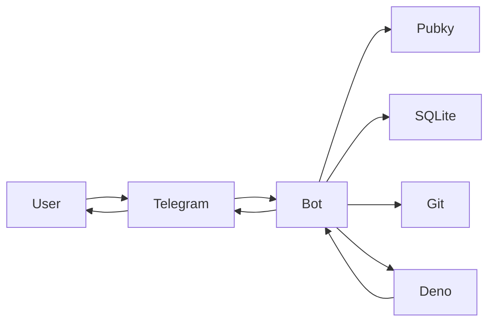
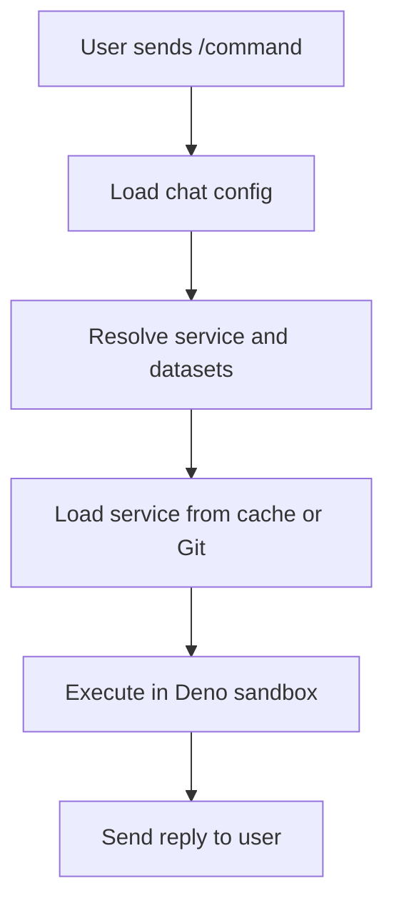

# Telegram Bot on Pubky — Development Specification

## 🎯 Executive Summary

A **modular Telegram bot framework** that combines the power of decentralized configuration with sandboxed TypeScript services. Think of it as a bot that can be easily customized per chat without code changes, where all configuration and datasets live on Pubky homeservers, and custom functionality is loaded from Git repositories and executed in secure sandboxes.

### Key Features at a Glance

- **🔧 Per-chat configuration** - Each chat can ha-ve its own bot behavior by setting a config through admin-commands.
- **📦 Modular services** - Add functionality by referencing Git repositories
- **🔒 Sandboxed execution** - Services run in isolated Deno processes with strict permissions
- **🌐 Decentralized config** - All configuration and datasets stored on Pubky homeservers. Users can easily switch to their own Bot instance. Additional implementatitions for different chat-platforms would allow simple switching.
- **⚡ Zero-downtime updates** - Change behavior without restarting the bot

### What Problems Does This Solve?

1. **No more bot proliferation** - One bot, many configurations instead of many specialized bots
2. **Easy customization** - Chat admins can modify behavior without developer intervention
3. **Secure extensibility** - Add features from untrusted sources safely
4. **Decentralized control** - No central authority controls your bot's configuration

---

## 🏗️ System Architecture



The system consists of several key components:

- **Bot Core (Telegraf)**: Handles Telegram API communication
- **Config Manager**: Loads configuration from Pubky homeservers and manages chat-specific overrides
- **Service Registry**: Clones, builds, and caches TypeScript services from Git repositories
- **Sandbox Host**: Executes services in isolated Deno processes with strict security
- **Local Database (SQLite)**: Caches configurations, services, and manages chat state

---

## 🔄 How It Works



### Simple Flow Example

1. User types `/links` in a chat
2. Bot checks if chat has custom config, otherwise uses default
3. Finds the "links" service in the config
4. Loads the service from Git repo (cached locally)
5. Loads the relevant Datasets from Homeservers (cached locally)
6. Spawns a secure Deno process with the service
7. Service generates response
8. Bot sends formatted response back to user

---

## 🚀 Quick Start Guide

### Environment Setup

```bash
# Copy example environment
cp .env.example .env

# Edit with your values
BOT_TOKEN=your_telegram_bot_token
DEFAULT_CONFIG_URL=pubky://{pub}/pub/pubky-bot-builder/bot-configs/default.json
```

### Basic Commands

- `/setconfig <pubky-url>` - (Admin only) Set custom config for this chat
- `/updateconfig` - (Admin only) Refresh configuration and services
- `/services` - List available commands in this chat

---

## 📋 Detailed Specifications

### Core Principles

The bot follows these architectural principles:

1. **Read-only Pubky integration** - Bot only reads from homeservers, never writes
2. **Telegraf for Telegram** - Standard, well-tested library for Telegram Bot API
3. **SQLite for local state** - Simple, reliable persistence for chat mappings and caches
4. **Git-based services** - All functionality comes from versioned Git repositories
5. **Security-first sandbox** - Services run with minimal permissions in Deno

### Directory Structure on Pubky Homeservers

Use the stable base path `/pub/pubky-bot-builder/` with Pubky.app‑style identifiers:

- Bot configs: `/pub/pubky-bot-builder/bot-configs/{config_id}.json` where `{config_id}` is a Timestamp ID (13‑char Crockford Base32).
- Service configs: `/pub/pubky-bot-builder/service-configs/{service_id}.json` where `{service_id}` is a Timestamp ID (13‑char Crockford Base32).
- Datasets: `/pub/pubky-bot-builder/datasets/{dataset_id}.json` where `{dataset_id}` is a Timestamp ID (13‑char Crockford Base32).

Example URIs:

- `pubky://{pub}/pub/pubky-bot-builder/bot-configs/0000000000000.json`
- `pubky://{pub}/pub/pubky-bot-builder/service-configs/0000000000001.json`
- `pubky://{pub}/pub/pubky-bot-builder/datasets/0000000000002.json`

Object shapes (trimmed examples)

1. Bot Chat Config

```json
{
  "id": "0000000000000",
  "name": "Default Bot Config",
  "version": "1.0.0",
  "created_at": 1731171234,
  "services": [
    {
      "service_config_ref": "pubky://{pub}/pub/pubky-bot-builder/service-configs/0000000000001.json",
      "overrides": { "time_window_days": 30 },
      "expose": true,
      "admin_only": false
    }
  ],
  "listeners": [
    {
      "service_config_ref": "pubky://{pub}/pub/pubky-bot-builder/service-configs/0000000000003.json"
    }
  ],
  "periodic": [
    {
      "service_config_ref": "pubky://{pub}/pub/pubky-bot-builder/service-configs/0000000000004.json"
    }
  ]
}
```

2. Service Config

```json
{
  "id": "0000000000001",
  "name": "Meetups Flow",
  "kind": "command_flow",
  "created_at": 1731171200,
  "source": {
    "repo": "https://github.com/example/meetups-flow.git",
    "ref": "<commit-or-immutable-tag>",
    "entry": "src/index.ts"
  },
  "capabilities": {
    "allowNetwork": true,
    "networkAllowlist": ["meetstr.com"],
    "timeoutMs": 20000
  },
  "default_config": {
    "trigger": {
      "command": "/meetups",
      "description": "Browse and filter meetups"
    },
    "datasets": {
      "cal": "pubky://{pub}/pub/pubky-bot-builder/datasets/0000000000002.json"
    },
    "timezone": "Europe/Zurich"
  }
}
```

3. Dataset (links with categories)

```json
{
  "id": "0000000000002",
  "name": "Community Links",
  "created_at": 1731171100,
  "kind": "dataset",
  "schema": "links@1",
  "data": {
    "categories": [
      {
        "name": "General",
        "links": [
          { "title": "Pubky", "url": "https://pubky.org" },
          { "title": "Docs", "url": "https://docs.pubky.org" }
        ]
      },
      {
        "name": "Community",
        "links": [
          { "title": "Dezentralschweiz", "url": "https://dezentralschweiz.org" }
        ]
      }
    ]
  }
}
```

### Environment Configuration

The bot requires these environment variables:

```env
# Telegram Bot API
BOT_TOKEN=xxxxx:yyyyy

# Pubky Configuration
PUBKY_BASE_PATH=/pub/pubky-bot-builder/
DEFAULT_CONFIG_URL=pubky://{pub}/pub/pubky-bot-builder/bot-configs/{uuid}.json

# Local Storage
LOCAL_DB_URL=file:./bot.sqlite
SERVICE_CACHE_DIR=.service-cache

# Security & Performance
SANDBOX_DEFAULT_TIMEOUT_MS=5000
```

### Local Database Schema

SQLite tables for persistence:

```sql
-- Chat-specific configuration overrides
CREATE TABLE chat_configs (
    chat_id TEXT PRIMARY KEY,
    config_url TEXT NOT NULL,
    updated_at TIMESTAMP NOT NULL
);

-- Cached Git repositories and built services
CREATE TABLE service_cache (
    service_url TEXT PRIMARY KEY,
    local_path TEXT NOT NULL,
    version_hash TEXT NOT NULL,
    last_pulled TIMESTAMP NOT NULL
);

-- Dataset caching with TTL
CREATE TABLE dataset_cache (
    url TEXT PRIMARY KEY,
    json TEXT NOT NULL,
    etag TEXT NULL,
    fetched_at TIMESTAMP NOT NULL,
    ttl_seconds INTEGER NOT NULL DEFAULT 300
);

-- Multi-step conversation state
CREATE TABLE flow_state (
    chat_id TEXT NOT NULL,
    service_id TEXT NOT NULL,
    state_json TEXT NOT NULL,
    updated_at TIMESTAMP NOT NULL,
    expires_at TIMESTAMP NOT NULL,
    PRIMARY KEY (chat_id, service_id)
);
```

### Service Types

The bot supports four types of services:

#### 1. Single Command (`single_command`)

- Responds to a `/command` with exactly one message
- Simple, stateless interactions
- Example: `/hello` → "Hello, World!"

#### 2. Command Flow (`command_flow`)

- Multi-step interactions with conversation state
- Uses inline keyboards and callback queries
- Example: `/meetups` → filter options → results → details

#### 3. Listener (`listener`)

- Processes messages based on patterns/filters
- Runs automatically on matching messages
- Example: Clean tracking parameters from URLs

#### 4. Periodic Command (`periodic_command`)

- Scheduled execution (cron-like)
- Sends proactive messages to chats
- Example: Daily digest of new content

### Security Model

The sandbox provides strong isolation:

- **Process isolation**: Each service runs in a separate Deno process
- **Permission model**: Default deny-all, explicit allow-list for network access
- **Resource limits**: CPU time, and execution timeout limits
- **No filesystem access**: Services cannot read/write files
- **No environment variables**: Clean execution environment
- **Network filtering**: Only allowed domains can be accessed

### Per‑chat routing and dispatch

- Snapshot build (per chat)

  - Source: chat_configs[chat_id] override → else DEFAULT_CONFIG_URL.
  - For each service_config_ref: fetch service config, merge default_config with per‑chat overrides.
  - Produce a routing snapshot:
    - commands: map command → { service_id, kind, expose, admin_only, capabilities, config }.
    - listeners: enabled listener entries.
    - periodic: enabled periodic_command entries.
  - Cache snapshot with a short TTL; invalidate on /setconfig, /updateconfig, and my_chat_member changes.

- Command handling

  - Single interceptor for bot_command.
  - Normalize /cmd and /cmd@BotName → cmd; look up in snapshot.commands.
  - Enforce expose/admin_only (admin check via getChatMember).
  - Resolve datasets from merged config; execute in sandbox with declared capabilities.
  - Reply with a generic error on missing route, denied access, or execution failure.

- Callback queries (flows)

  - callback_data prefix: "svc:<service_id>|<payload>".
  - Router extracts service_id, loads flow_state(chat_id, service_id), invokes onFlowStep.
  - Keep callback payloads compact; Telegram enforces strict size limits for callback_data.
  - State is updated per step; start/end is managed by the flow’s command and completion logic.

- Listeners

  - Fan‑out incoming messages to enabled listeners.
  - Apply per‑chat concurrency limits and rate caps to avoid overload.
  - Each listener executes in its own sandboxed run.

- Command discovery

  - After snapshot changes, update chat‑scoped command menu via setMyCommands(BotCommandScopeChat).
  - Menu is advisory; router still enforces expose/admin_only on execution.
  - Some clients refresh the menu only when the chat is reopened; scoped updates still apply per chat even if the UI lags.

- State model

  - flow_state keyed by (chat_id, service_id) with TTL.
  - Clear state on flow completion or expiry.

- Periodic execution
  - Scheduler enumerates snapshot.periodic per chat and triggers on schedule.
  - Uses the same permissions, dataset resolution, and sandbox execution path as commands.

### Service Development Interface

Services implement a standard TypeScript interface:

```typescript
export interface Service {
  metadata: {
    name: string;
    version: string;
    description: string;
    author: string;
    type: ServiceKind;
  };

  // Lifecycle hooks
  init?: (ctx: BootContext) => Promise<void>;
  dispose?: () => Promise<void>;

  // Command handlers
  onCommand?: (message: any, ctx: ServiceContext) => Promise<void>;
  onFlowStart?: (message: any, ctx: ServiceContext) => Promise<void>;
  onFlowStep?: (
    message: any,
    state: Record<string, any>,
    ctx: ServiceContext
  ) => Promise<void>;

  // Message processing
  onMessage?: (message: any, ctx: ServiceContext) => Promise<void>;

  // Scheduled execution
  onScheduled?: (ctx: ServiceContext) => Promise<void>;
}
```

### Runtime Context

Services receive a context object with limited capabilities:

```typescript
export interface ServiceContext {
  // Telegram API (proxied through parent)
  reply: (text: string, options?: ReplyOptions) => Promise<void>;
  editMessageText: (text: string, options?: ReplyOptions) => Promise<void>;
  inlineKeyboard: (rows: ButtonRow[]) => any;

  // Configuration and data
  datasets: Record<string, any>;
  serviceConfig: Record<string, any>;

  // Utilities
  buildActionUrl: (endpoint: string, payload: Record<string, any>) => string;

  // State management (for flows)
  state: {
    set: (key: string, value: any, ttlSeconds?: number) => Promise<void>;
    get: (key: string) => Promise<any>;
    clear: () => Promise<void>;
  };

  // Logging
  log: (level: "debug" | "info" | "warn" | "error", msg: string) => void;
}
```

---

## 📝 Example Services

### Simple Hello World Command

```typescript
const service: Service = {
  metadata: {
    name: "hello_world",
    version: "1.0.0",
    description: "Replies with a configurable greeting",
    author: "example",
    type: "single_command",
  },

  async onCommand(message, ctx) {
    const greeting = ctx.serviceConfig.greeting ?? "Hello!";
    await ctx.reply(greeting, { disable_web_page_preview: true });
  },
};

export default service;
```

### Interactive Flow Example

```typescript
const service: Service = {
  metadata: {
    name: "meetups_flow",
    version: "1.0.0",
    description: "Interactive meetup browser",
    author: "example",
    type: "command_flow",
  },

  async onFlowStart(message, ctx) {
    await ctx.state.clear();

    const keyboard = ctx.inlineKeyboard([
      [{ text: "This week", callback_data: "filter:this_week" }],
      [{ text: "Next week", callback_data: "filter:next_week" }],
      [{ text: "All upcoming", callback_data: "filter:all" }],
    ]);

    await ctx.reply("Choose a time filter:", { reply_markup: keyboard });
  },

  async onFlowStep(message, state, ctx) {
    const callbackData = message.callback_query?.data;

    if (callbackData?.startsWith("filter:")) {
      const filter = callbackData.split(":")[1];
      await ctx.state.set("selectedFilter", filter);

      // Fetch and display filtered meetups
      const meetups = await this.fetchMeetups(filter, ctx);
      await ctx.editMessageText(this.formatMeetups(meetups));
    }
  },

  async fetchMeetups(filter: string, ctx: ServiceContext) {
    // Implementation details...
  },
};

export default service;
```

### Message Listener Example

```typescript
const service: Service = {
  metadata: {
    name: "url_cleaner",
    version: "1.0.0",
    description: "Removes tracking parameters from URLs",
    author: "example",
    type: "listener",
  },

  async onMessage(message, ctx) {
    if (!message.entities?.some((e) => e.type === "url")) return;

    const text = message.text || "";
    const cleanedUrls = this.cleanTrackingParams(text, ctx.serviceConfig);

    if (cleanedUrls.length > 0) {
      await ctx.reply(`Cleaned URLs:\n${cleanedUrls.join("\n")}`);
    }
  },

  cleanTrackingParams(text: string, config: any): string[] {
    // Implementation details...
    return [];
  },
};

export default service;
```

---

## 🔧 Implementation Details

### Telegraf Integration

The bot uses Telegraf for Telegram API communication:

```typescript
import { Telegraf } from "telegraf";

const bot = new Telegraf(process.env.BOT_TOKEN!);

// Admin commands
bot.command("setconfig", async (ctx) => {
  if (!(await isAdmin(ctx))) return;
  const [, url] = (ctx.message.text || "").split(" ");
  if (!url?.startsWith("pubky://")) return;

  await persistChatConfig(ctx.chat.id, url);
  await ctx.reply("✅ Configuration updated for this chat.");
});

// Service discovery
bot.command("services", async (ctx) => {
  const config = await getActiveConfig(ctx.chat.id);
  const svcEntries = await Promise.all(
    (config.services || []).map(async (entry) => ({
      entry,
      svc: await getServiceConfig(entry.service_config_ref),
    }))
  );

  const commands = (
    await Promise.all(
      svcEntries.map(async ({ entry, svc }) => {
        if (!entry.expose) return null;
        if (entry.admin_only && !(await isAdmin(ctx))) return null;
        const t = svc?.default_config?.trigger;
        return t ? `• ${t.command} – ${t.description}` : null;
      })
    )
  )
    .filter(Boolean)
    .join("\n");

  await ctx.reply(`Available commands:\n${commands}`);
});
```

### Service Loading and Caching

Services are loaded from Git repositories and cached locally:

```typescript
class ServiceLoader {
  async loadService(serviceConfig: ServiceConfig): Promise<LoadedService> {
    const cacheKey = `${serviceConfig.source.repo}:${serviceConfig.source.ref}`;

    // Check cache first
    const cached = await this.getFromCache(cacheKey);
    if (cached && cached.version_hash === serviceConfig.source.ref) {
      return cached;
    }

    // Clone/pull repository
    const repoPath = await this.cloneRepo(
      serviceConfig.source.repo,
      serviceConfig.source.ref
    );

    // Build TypeScript to single JS bundle
    const bundlePath = await this.buildService(
      repoPath,
      serviceConfig.source.entry
    );

    // Validate service interface
    const service = await this.validateService(bundlePath);

    // Cache for future use
    await this.cacheService(cacheKey, bundlePath, service);

    return service;
  }
}
```

Packaging and execution

- Build a single ESM bundle using a bundler like esbuild or rolldown; or
- Ship ESM modules as-is and execute via a data URL or feed code through stdin to avoid filesystem reads.
- Keep the sandbox at `--deny-all` and only add `--allow-net=<hosts>` when required. Avoid `--allow-read` by delivering code via stdin/data URLs.

### Sandbox Execution

Services run in isolated Deno processes using Deno.Command:

```typescript
class SandboxHost {
  async execute(service: LoadedService, payload: ExecutePayload): Promise<any> {
    const args = ["run", "--quiet", "--deny-all"];

    // Network: allow only declared hosts. If none provided, no network.
    if (service.capabilities.allowNetwork) {
      const hosts = service.capabilities.networkAllowlist?.join(",") || "";
      if (hosts) args.push(`--allow-net=${hosts}`);
    }

    // No filesystem access: do not add --allow-read/--allow-write
    // Execute the bundle path or a data URL/stdin-fed module
    args.push(service.bundlePath);

    const command = new Deno.Command("deno", {
      args,
      stdin: "piped",
      stdout: "piped",
      stderr: "piped",
    });

    const child = command.spawn();

    // Send execution payload
    const writer = child.stdin.getWriter();
    const message = new TextEncoder().encode(
      JSON.stringify({
        type: "execute",
        payload,
        traceId: crypto.randomUUID(),
      }) + "\n"
    );
    await writer.write(message);
    await writer.close();

    // Collect output with timeout
    const timeout = service.capabilities.timeoutMs ?? 5000;
    const output = await Promise.race([
      child.output(),
      new Promise<never>((_, reject) =>
        setTimeout(() => reject(new Error("timeout")), timeout)
      ),
    ]);

    const stdout = new TextDecoder().decode(output.stdout);
    const stderr = new TextDecoder().decode(output.stderr);
    if (output.code !== 0) {
      throw new Error(`Sandbox exited ${output.code}: ${stderr}`);
    }
    return this.parseResponse(stdout);
  }
}
```

### Pubky client integration (read-only)

```typescript
import { Client } from "@synonymdev/pubky";

// One shared client (no signup/signin needed for public reads)
export const pk = new Client();

export async function fetchJson<T = any>(
  pubkyUrl: string
): Promise<{ json: T; etag: string | null }> {
  const res = await pk.fetch(pubkyUrl);
  if (!res.ok) throw new Error(`Pubky fetch failed ${res.status}: ${pubkyUrl}`);
  const etag = res.headers.get("etag");
  const json = (await res.json()) as T;
  return { json, etag };
}

// High-level helpers aligned with this spec’s paths
export async function getBotConfig(url: string) {
  // e.g., pubky://{pub}/pub/pubky-bot-builder/bot-configs/0000000000000.json
  return fetchJson(url);
}

export async function getServiceConfig(url: string) {
  // e.g., pubky://{pub}/pub/pubky-bot-builder/service-configs/0000000000001.json
  return fetchJson(url);
}

export async function getDataset(url: string) {
  // e.g., pubky://{pub}/pub/pubky-bot-builder/datasets/0000000000002.json
  return fetchJson(url);
}

// Optional discovery (list directory contents if needed later)
export async function listServiceConfigs(prefixUrl: string) {
  // prefixUrl example: pubky://{pub}/pub/pubky-bot-builder/service-configs/
  return pk.list(prefixUrl, undefined, false, 100);
}
```

### Dataset Resolution

Datasets are fetched from Pubky homeservers via pubky:// and cached (SQLite table `dataset_cache`).

```typescript
import { fetchJson } from "./pubky-client"; // see helpers above

class DatasetManager {
  constructor(private readonly ttlSeconds = 300) {}

  async resolveDatasets(
    serviceConfig: any,
    overrides?: any
  ): Promise<Record<string, any>> {
    const datasets: Record<string, any> = {};
    const sources = {
      ...(serviceConfig?.datasets || {}),
      ...((overrides && overrides.datasets) || {}),
    };

    for (const [key, url] of Object.entries(sources)) {
      if (typeof url === "string" && url.startsWith("pubky://")) {
        datasets[key] = await this.fetchDataset(url);
      }
    }
    return datasets;
  }

  private async fetchDataset(url: string): Promise<any> {
    const cached = await this.getCachedDataset(url);
    if (cached && !this.isExpired(cached.fetched_at, cached.ttl_seconds)) {
      return JSON.parse(cached.json);
    }

    const { json, etag } = await fetchJson<any>(url);
    await this.cacheDataset(url, json, etag, this.ttlSeconds);
    return json;
  }

  // Stubbed cache helpers – wire to SQLite dataset_cache
  private async getCachedDataset(
    url: string
  ): Promise<{ json: string; fetched_at: number; ttl_seconds: number } | null> {
    return null;
  }
  private isExpired(fetchedAt: number, ttl: number) {
    return Date.now() / 1000 > fetchedAt + ttl;
  }
  private async cacheDataset(
    url: string,
    data: any,
    etag: string | null,
    ttlSeconds: number
  ) {
    /* upsert into dataset_cache(url, json, etag, fetched_at, ttl_seconds) */
  }
}
```

---

## 🛡️ Security Considerations

### Sandbox Security Model

- **Process Isolation**: Each service execution runs in a separate process
- **Capability-based Security**: Services only get permissions they explicitly need
- **Resource Limits**: CPU, and time constraints prevent resource exhaustion
- **Network Restrictions**: Only explicitly allowed domains can be contacted
- **No Persistent State**: Services cannot persist data between executions
- **Input Validation**: All data passed to services is validated and sanitized

Notes

- Allow-net semantics: the allowlist maps to Deno's `--allow-net` host list and is checked against the URL host, not the resolved IP. If you pass `--allow-net` without hosts, all outbound requests are allowed; always provide a comma-separated host list per service.
- Optional deny layering: consider parent-process checks to block known-bad targets or to pin DNS if higher assurance is needed.
- Filesystem reads: do not grant `--allow-read`. Run code via stdin or data URLs or pre-mount read-only artifacts to stay aligned with "no filesystem access".

### Configuration Security

- **Admin-only Configuration**: Only chat administrators can modify bot behavior
- **Immutable Service References**: Services are pinned to specific Git commits
- **Signed Commits**: Future versions may require signed Git commits
- **Configuration Validation**: All configs are validated against schemas

### Data Privacy

- **No Message Logging**: Services don't have access to persistent message history => Setting a listener that catches any message and stores it externally could still technically allow a service to log everything.
- **Ephemeral State**: Conversation state has configurable TTL
- **Minimal Data Exposure**: Services only receive data they need for execution

---

## 🌐 Web Interface

A companion web application for:

- Creating and managing service configurations
  - Users can register new services and easily configure related Datasets with validation from Examples.
  - Simple JSON-Writer during development.
- Bot configs
  - Allows user to create a simple bot-config by displaying a list of all registered services and allowing them to drag and drop them into their config.
- Display of pre-configured bot-configs (created by myself) for users that don't want to create custom ones. Outlining what they do. => Displaying this on telegram as well would make sense.
- Page explaining usage of Bot and how it works.
- Based on next.js
- Idea is to start with a more simple web-interface that can then grow to allowing more features like:
  - Semantic Tagging and Discovery of configured Services and Bot configurations
  - Drag and drop style service and bot builder
  - Versioned udpdates of services
  - SaaS custom bot hosts (Own name and global config)

---

## 💼 Initial Services

- **Welcome message**
- **Links** - With categories as inline-keyboard callback
- **NIP-52 Meetup-puller**
  - Use either meetstr-api or fetch directly using ndk (https://meetstr.com/api/calendar/naddr1qvzqqqrukspzpzd4ye7z7x886as20jpf8xw46rdfywmg04f75f4xl566wu8entspqqyrsdeevfskxvfj8p34pq)
  - Config for timerange-callback (or disabled) and calendar naddr for callback
- **Periodically pull Meetups**
- **Tracking-URL cleaner** - Responds with URL without trackers.
- **Alternative Frontends** - Responds with url to alternative frontend like nitter
  - Dataset mapping frontends to alternative ones
- **Shitcoin-Alarm** - Responds to someone mentioning shitcoins/shitcoiner with a joke
  - Dataset for both triggerwords and Jokes.
  - Seperate Ethereum Dataset with jokes linking to https://pocketethereum.com

## 📚 Additional Resources

### Development Tools

- **Service Templates**: Starter templates for creating new services
- **Testing Framework**: Automated testing tools for services

### Example Datasets

The specification includes several example datasets:

- **Links Collection**: Categorized links for communities
- **Trigger Words**: Keywords that activate listener services
- **Response Templates**: Configurable response messages
- **Welcome Messages**: Customizable welcome text for new members

### Service

Complete working examples services are provided for:

- Simple command responders
- Interactive conversation flows
- Message listeners and filters
- Scheduled content delivery

## 🚀 Future Enhancements

- Implement Core-Bot functionality for other messengers like Matrix, Signal, Discord, ...
- Improve Web UI functionalities for simpler configs
  - Create a deep-linking signing-service to allow users to store meetups (or other events) either on nostr or pubky by opening generated url and signing it in web-interface. This would also allow forwarding the formatted event to admins who sign it on their behalf.
- Create Services allowing creation of Meetups for both NIP-52 and Calky based calendars using above described method for signing
- Create Docker Image
- Allow hosting bot instance on Start9/Umbrel nodes
