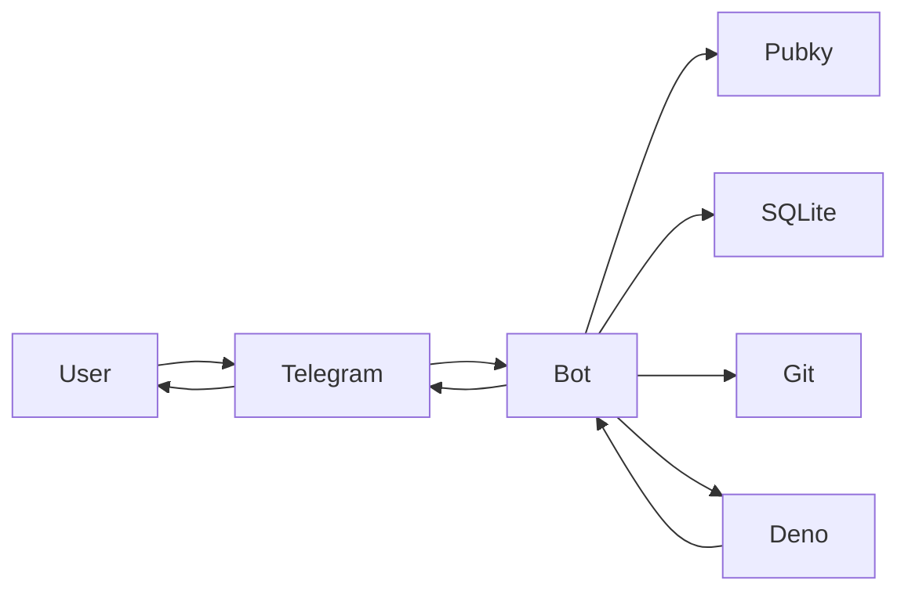
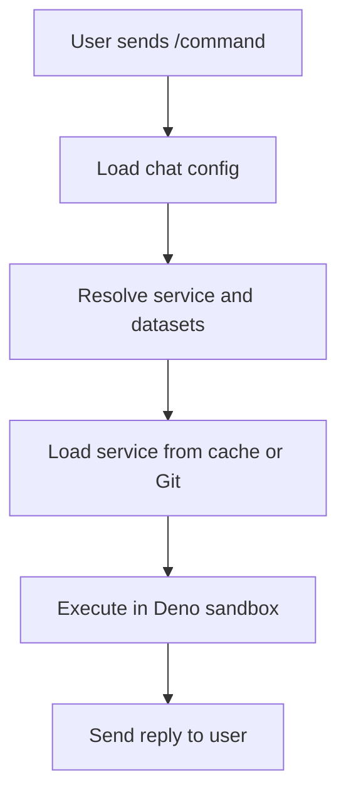

# Telegram Bot on Pubky — Development Specification

## 🎯 Executive Summary

A **modular Telegram bot framework** that combines the power of decentralized
configuration with sandboxed TypeScript services. Think of it as a bot that can
be easily customized per chat without code changes, where all configuration and
datasets live on Pubky homeservers, and custom functionality is loaded from Git
repositories and executed in secure sandboxes.

### Key Features at a Glance

- **🔧 Per-chat configuration** - Each chat can have its own bot behavior by
  setting a config through admin-commands.
- **📦 Modular services** - Add functionality by referencing Git repositories
- **🔒 Sandboxed execution** - Services run in isolated Deno processes with
  strict permissions
- **🌐 Decentralized config** - All configuration and datasets stored on Pubky
  homeservers. Users can easily switch to their own Bot instance. Additional
  implementations for different chat-platforms would allow simple switching.
- **⚡ Zero-downtime updates** - Change behavior without restarting the bot

### What Problems Does This Solve?

1. **No more bot proliferation** - One bot, many configurations instead of many
   specialized bots
2. **Easy customization** - Chat admins can modify behavior without developer
   intervention
3. **Secure extensibility** - Add features from untrusted sources safely
4. **Decentralized control** - No central authority controls your bot's
   configuration

---

## 🏗️ System Architecture



The system consists of several key components:

- **Bot Core (grammY)**: Handles Telegram API communication
- **Config Manager**: Loads configuration from Pubky homeservers and manages
  chat-specific overrides
- **Service Registry**: Resolves and caches ESM services from jsr (preferred) or
  pinned Git repositories
- **Sandbox Host**: Executes services in isolated Deno processes with strict
  security
- **Local Database (SQLite)**: Caches configurations, services, and manages chat
  state

---

## 🔄 How It Works



### Simple Flow Example

1. User types `/links` in a chat
2. Bot checks if chat has custom config, otherwise uses default
3. Finds the "links" service in the config
4. Loads the service from jsr (or pinned Git) and caches it
5. Loads the relevant Datasets from Homeservers (cached locally)
6. Spawns a secure Deno process with the service
7. Service generates response
8. Bot sends formatted response back to user

---

## 🚀 Quick Start Guide

### Environment Setup

```bash
# Copy example environment
cp .env.example .env

# Edit with your values
BOT_TOKEN=your_telegram_bot_token
DEFAULT_CONFIG_URL=pubky://{pub}/pub/pubky-bot-builder/bot-configs/default.json
```

### Basic Commands

- `/setconfig <pubky-url>` - (Admin only) Set custom config for this chat
- `/updateconfig` - (Admin only) Refresh configuration and services
- `/services` - List available commands in this chat

---

## 📋 Detailed Specifications

### Core Principles

The bot follows these architectural principles:

1. **Read-only Pubky integration** - Bot only reads from homeservers, never
   writes
2. **grammY for Telegram** - Standard, well-tested library for Telegram Bot API
3. **SQLite for local state** - Simple, reliable persistence for chat mappings
   and caches
4. **jsr-first services** - All functionality comes from published jsr packages
   (pinned versions); pinned Git refs are an optional fallback
5. **Security-first sandbox** - Services run with minimal permissions in Deno

### Directory Structure on Pubky Homeservers

Use the stable base path `/pub/pubky-bot-builder/` with Pubky.app‑style
identifiers:

- Bot configs: `/pub/pubky-bot-builder/bot-configs/{config_id}.json` where
  `{config_id}` is a Timestamp ID (13‑char Crockford Base32).
- Service configs: `/pub/pubky-bot-builder/service-configs/{service_id}.json`
  where `{service_id}` is a Timestamp ID (13‑char Crockford Base32).
- Datasets: `/pub/pubky-bot-builder/datasets/{dataset_id}.json` where
  `{dataset_id}` is a Timestamp ID (13‑char Crockford Base32).

Example URIs:

- `pubky://{pub}/pub/pubky-bot-builder/bot-configs/0000000000000.json`
- `pubky://{pub}/pub/pubky-bot-builder/service-configs/0000000000001.json`
- `pubky://{pub}/pub/pubky-bot-builder/datasets/0000000000002.json`

Object shapes (trimmed examples)

1. Bot Chat Config

```json
{
  "id": "0000000000000",
  "name": "Default Bot Config",
  "version": "1.0.0",
  "created_at": 1731171234,
  "services": [
    {
      "service_config_ref": "pubky://{pub}/pub/pubky-bot-builder/service-configs/0000000000001.json",
      "overrides": { "time_window_days": 30 },
      "expose": true,
      "admin_only": false
    }
  ],
  "listeners": [
    {
      "service_config_ref": "pubky://{pub}/pub/pubky-bot-builder/service-configs/0000000000003.json"
    }
  ],
  "periodic": [
    {
      "service_config_ref": "pubky://{pub}/pub/pubky-bot-builder/service-configs/0000000000004.json"
    }
  ]
}
```

2. Service Config

```json
{
  "id": "0000000000001",
  "name": "Meetups Flow",
  "kind": "command_flow",
  "created_at": 1731171200,
  "source": {
    "type": "jsr",
    "package": "@gillohner/meetups_flow",
    "version": "1.0.0"
  },
  "capabilities": {
    "allowNetwork": true,
    "networkAllowlist": ["meetstr.com"],
    "timeoutMs": 20000
  },
  "default_config": {
    "trigger": {
      "command": "/meetups",
      "description": "Browse and filter meetups"
    },
    "datasets": {
      "cal": "pubky://{pub}/pub/pubky-bot-builder/datasets/0000000000002.json"
    },
    "timezone": "Europe/Zurich"
  }
}
```

Service IPC template (stdin → stdout JSON):

```ts
// mod.ts (service entry)
async function readLine(): Promise<string> {
  const dec = new TextDecoder();
  const buf = new Uint8Array(8192);
  const n = await Deno.stdin.read(buf);
  if (n === null) return "";
  return dec.decode(buf.subarray(0, n)).trim();
}

type ExecutePayload = { event: any; ctx: any };

const raw = await readLine();
const payload = JSON.parse(raw) as ExecutePayload;
const result = await service.execute(payload.event, payload.ctx);
console.log(JSON.stringify(result) + "\n");
```

Alternative (Git fallback, pinned commit only):

```json
{
  "id": "0000000000001",
  "name": "Meetups Flow",
  "kind": "command_flow",
  "created_at": 1731171200,
  "source": {
    "type": "git",
    "repo": "https://github.com/example/meetups-flow.git",
    "commit": "a1b2c3d4e5f6a1b2c3d4e5f6a1b2c3d4e5f6a1b2",
    "entry": "src/index.ts"
  },
  "capabilities": {
    /* ... */
  },
  "default_config": {
    /* ... */
  }
}
```

3. Dataset (links with categories)

```json
{
  "id": "0000000000002",
  "name": "Community Links",
  "created_at": 1731171100,
  "kind": "dataset",
  "schema": "links@1",
  "data": {
    "categories": [
      {
        "name": "General",
        "links": [
          { "title": "Pubky", "url": "https://pubky.org" },
          { "title": "Docs", "url": "https://docs.pubky.org" }
        ]
      },
      {
        "name": "Community",
        "links": [
          { "title": "Dezentralschweiz", "url": "https://dezentralschweiz.org" }
        ]
      }
    ]
  }
}
```

### Environment Configuration

The bot requires these environment variables:

```env
# Telegram Bot API
BOT_TOKEN=xxxxx:yyyyy

# Pubky Configuration
PUBKY_BASE_PATH=/pub/pubky-bot-builder/
DEFAULT_CONFIG_URL=pubky://{pub}/pub/pubky-bot-builder/bot-configs/{uuid}.json

# Local Storage
LOCAL_DB_URL=file:./bot.sqlite
SERVICE_CACHE_DIR=.service-cache

# Security & Performance
SANDBOX_DEFAULT_TIMEOUT_MS=5000
```

#### Deno runtime specifics

- Use `Deno.env.get` for configuration and run with `--allow-env`.
- For SQLite, prefer Deno-first drivers. Example: `jsr:@db/sqlite@0.12` or `https://deno.land/x/sqlite@v3/mod.ts`.
  If using Node bindings, import with `npm:` (e.g., `npm:better-sqlite3`) and grant `--allow-read --allow-write` only to the DB path.
- Prefer import maps in `deno.json` for stable specifiers; use `deno.lock` for integrity and `--reload` to refresh cache when updating dependencies.

Example import (Deno-first):

```ts
import { DB } from "https://deno.land/x/sqlite@v3.9.1/mod.ts";
const db = new DB("./bot.sqlite");
```

### Local Database Schema

SQLite tables for persistence:

````sql
-- Chat-specific configuration overrides
CREATE TABLE chat_configs (
    chat_id TEXT PRIMARY KEY,
    config_url TEXT NOT NULL,
    updated_at TIMESTAMP NOT NULL
);

-- Cached Git repositories and built services
CREATE TABLE service_cache (
    service_url TEXT PRIMARY KEY,
    local_path TEXT NOT NULL,
    version_hash TEXT NOT NULL,
    last_pulled TIMESTAMP NOT NULL
);

-- Dataset caching with TTL
CREATE TABLE dataset_cache (
    url TEXT PRIMARY KEY,
    json TEXT NOT NULL,
    etag TEXT NULL,
    fetched_at TIMESTAMP NOT NULL,
    ttl_seconds INTEGER NOT NULL DEFAULT 300
);

-- Multi-step conversation state
CREATE TABLE flow_state (
    chat_id TEXT NOT NULL,
    service_id TEXT NOT NULL,
    state_json TEXT NOT NULL,
    version INTEGER NOT NULL DEFAULT 1,
    updated_at TIMESTAMP NOT NULL,
    expires_at TIMESTAMP NOT NULL,
    PRIMARY KEY (chat_id, service_id)
);

#### Optimistic Locking Semantics

- Read: `SELECT state_json, version FROM flow_state WHERE chat_id=? AND service_id=?`.
- Update: increment `version` only if it matches the previously read value.

SQL example

```sql
UPDATE flow_state
SET state_json = :next_state,
    version = version + 1,
    updated_at = :now,
    expires_at = :exp
WHERE chat_id = :chat_id
  AND service_id = :service_id
  AND version = :expected_version;
````

- Detect conflict by checking `changes() == 1` (SQLite) or affected rows.
- Retry policy: up to 3 retries with small jitter; on persistent conflict, abort
  the step with a soft error and ask the user to retry.

State directive application

- On incoming `callback`, load `(state_json, version)` and pass them to the service as `event.state` and `event.stateVersion`.
- When the service returns a response with `state`:
  - `clear`: delete row `DELETE FROM flow_state WHERE chat_id=? AND service_id=?`.
  - `replace`: upsert row with `state_json = JSON(value)`, `version = version + 1` guarded by `version = :expected_version`.
  - `merge`: compute `next_state = deepMerge(current_state, value)` in parent process, then update using the guarded `UPDATE` shown above.
- If the guarded update affects 0 rows, treat as a version conflict and apply the retry policy.

````
### Service Types

The bot supports four types of services:

#### 1. Single Command (`single_command`)

- Responds to a `/command` with exactly one message
- Simple, stateless interactions
- Example: `/hello` → "Hello, World!"

#### 2. Command Flow (`command_flow`)

- Multi-step interactions with conversation state
- Uses inline keyboards and callback queries via grammY
- Example: `/meetups` → filter options → results → details

#### 3. Listener (`listener`)

- Processes messages based on patterns/filters
- Runs automatically on matching messages
- Example: Clean tracking parameters from URLs

#### 4. Periodic Command (`periodic_command`)

- Scheduled execution (cron-like)
- Sends proactive messages to chats
- Example: Daily digest of new content

### Per‑chat routing and dispatch

- Snapshot build (per chat)

  - Source: chat_configs[chat_id] override → else DEFAULT_CONFIG_URL.
  - For each service_config_ref: fetch service config, merge default_config with per‑chat overrides.
  - Produce a routing snapshot:
    - commands: map command → { service_id, kind, expose, admin_only, capabilities, config }.
    - listeners: enabled listener entries.
    - periodic: enabled periodic_command entries.
  - Cache snapshot with a short TTL; invalidate on /setconfig, /updateconfig, and my_chat_member changes.

- Command handling

  - Single interceptor for bot_command.
  - Normalize /cmd and /cmd@BotName → cmd; look up in snapshot.commands.
  - Enforce expose/admin_only (admin check via getChatMember).
  - Resolve datasets from merged config; execute in sandbox with declared capabilities.
  - Reply with a generic error on missing route, denied access, or execution failure.

- Callback queries (flows)

  - callback_data prefix: "svc:<service_id>|<payload>".
  - Router extracts service_id, loads flow_state(chat_id, service_id), invokes service.execute with a `callback` event.
  - Keep callback payloads compact; Telegram enforces strict size limits for callback_data.
  - State is updated per step; start/end is managed by the flow’s command and completion logic.
  - Keep callback_data under 64 bytes. Use short IDs: `svc:<sid>|<k>:<v>` where `<sid>` and values are compact. Store large payloads server-side and reference by short token.

- Listeners

  - Fan‑out incoming messages to enabled listeners.
  - Apply per‑chat concurrency limits and rate caps to avoid overload.
  - Each listener executes in its own sandboxed run.

- Command discovery

  - After snapshot changes, update chat‑scoped command menu via setMyCommands(BotCommandScopeChat).
  - Menu is advisory; router still enforces expose/admin_only on execution.
  - Some clients refresh the menu only when the chat is reopened; scoped updates still apply per chat even if the UI lags.

- State model

  - flow_state keyed by (chat_id, service_id) with TTL.
  - Clear state on flow completion or expiry.

- Periodic execution

  - Scheduler enumerates snapshot.periodic per chat and triggers on schedule.
  - Uses the same permissions, dataset resolution, and sandbox execution path as commands.

#### Cron-like Scheduling for Periodic Commands

- Schedule format: standard 5-field cron (minute hour day-of-month month day-of-week), UTC by default.
- Storage: each periodic service in chat snapshot includes `{ schedule: string }`. If omitted, default is daily at 09:00 local to chat’s timezone if provided, else UTC.
- Evaluation: a single scheduler tick every minute matches due entries and enqueues executions. Skips missed runs during downtime; does not catch up.
- Concurrency: per chat and per service mutual exclusion. If the previous run is still active, skip the current tick.
- Jitter: add 0–10s random delay to reduce thundering herd across chats.
- Error policy: log errors and continue. Apply backoff if a service fails consecutively more than N times (e.g., exponential up to 1 hour), then resume normal schedule after a success.

- After snapshot changes, update commands via `bot.api.setMyCommands([...], { scope: { type: "chat", chat_id } })` and still enforce checks at runtime.
- Normalize commands and `callback_query:data` as `svc:<service_id>|<payload>` and route to service flow handlers.

#### Compact Callback Data Format

- Wire format: `svc:<sid>|<pairs>` where `<sid>` is a short service ID (<= 8 chars), and `<pairs>` is a `:`-prefixed sequence of `k:v` tokens separated by `;`.
- Allowed chars: `[A-Za-z0-9_.-]` for both keys and values to avoid encoding.
- Size budget: total length <= 64 bytes (Telegram limit). Keep `<sid>` and tokens short.

Examples
- `svc:meetups|f:tw` → service `meetups`, key `f` (filter) `tw` (this week)
- `svc:links|c:gen;p:2` → service `links`, category `gen`, page `2`

Parsing

```ts
function parseCallbackData(data: string): { sid: string; params: Record<string, string> } | null {
  if (!data.startsWith("svc:")) return null;
  const [svcPart, pairPart = ""] = data.split("|");
  const sid = svcPart.slice(4);
  const params: Record<string, string> = {};
  if (pairPart) {
    for (const kv of pairPart.split(";")) {
      if (!kv) continue;
      const [k, v = ""] = kv.split(":");
      if (k) params[k] = v;
    }
  }
  return { sid, params };
}
````

### Service Development Interface

Services implement a standard TypeScript interface with a single entry point:

```typescript
export interface Service {
  metadata: ServiceMetadata;
  execute(event: ServiceEvent, ctx: ServiceContext): Promise<ServiceResponse>;
}

export interface ServiceMetadata {
  name: string;
  version: string;
  description: string;
  author: string;
  type: ServiceKind;
}

export type ServiceEvent =
  | { type: "command"; message: Message }
  | {
      type: "callback";
      query: CallbackQuery;
      state?: Record<string, any>;
      stateVersion?: number;
    }
  | { type: "message"; message: Message }
  | { type: "scheduled"; trigger: string };

export type ServiceKind =
  | "single_command"
  | "command_flow"
  | "listener"
  | "periodic_command";

export type StateDirective =
  | { op: "clear" }
  | { op: "replace"; value: Record<string, any> }
  | { op: "merge"; value: Record<string, any> };

export type ServiceResponse =
  | {
      kind: "reply";
      text: string;
      options?: ReplyOptions;
      state?: StateDirective;
    }
  | {
      kind: "edit";
      text: string;
      options?: ReplyOptions;
      state?: StateDirective;
    }
  | { kind: "none"; state?: StateDirective }
  | { kind: "error"; message: string };
```

### Runtime Context

Services receive a context object with limited capabilities:

```typescript
export interface ServiceContext {
  // Serializable-only data available inside the sandboxed service
  datasets: Record<string, any>;
  serviceConfig: Record<string, any>;
  chatId: string;
  userId: string;
  locale?: string;
  timezone?: string;
}
```

---

## 📝 Example Services

### Simple Hello World Command

```typescript
const service: Service = {
  metadata: {
    name: "hello_world",
    version: "1.0.0",
    description: "Replies with a configurable greeting",
    author: "example",
    type: "single_command",
  },

  async execute(event, ctx) {
    if (event.type !== "command") return { kind: "none" };
    const greeting = ctx.serviceConfig.greeting ?? "Hello!";
    return {
      kind: "reply",
      text: greeting,
      options: { disable_web_page_preview: true },
    };
  },
};

export default service;
```

### Interactive Flow Example

```typescript
const service: Service = {
  metadata: {
    name: "meetups_flow",
    version: "1.0.0",
    description: "Interactive meetup browser",
    author: "example",
    type: "command_flow",
  },

  async execute(event, ctx) {
    if (event.type === "command") {
      const keyboard = {
        inline_keyboard: [
          [{ text: "This week", callback_data: "svc:meetups|f:tw" }],
          [{ text: "Next week", callback_data: "svc:meetups|f:nw" }],
          [{ text: "All upcoming", callback_data: "svc:meetups|f:all" }],
        ],
      } as const;
      return {
        kind: "reply",
        text: "Choose a time filter:",
        options: { reply_markup: keyboard },
        state: { op: "clear" },
      };
    }
    if (event.type === "callback") {
      const data = event.query.data ?? "";
      const parsed = parseCallbackData(data);
      const filter = parsed?.params["f"] ?? "all";
      const next = { selectedFilter: filter };
      const meetups = await fetchMeetups(filter, ctx);
      return {
        kind: "edit",
        text: formatMeetups(meetups),
        state: { op: "merge", value: next },
      };
    }
    return { kind: "none" };
  },
};

export default service;
```

### Message Listener Example

```typescript
const service: Service = {
  metadata: {
    name: "url_cleaner",
    version: "1.0.0",
    description: "Removes tracking parameters from URLs",
    author: "example",
    type: "listener",
  },

  async execute(event, ctx) {
    if (event.type !== "message") return { kind: "none" };
    const msg = event.message;
    if (!msg.entities?.some((e) => e.type === "url")) return { kind: "none" };
    const text = msg.text || "";
    const cleanedUrls = cleanTrackingParams(text, ctx.serviceConfig);
    if (cleanedUrls.length === 0) return { kind: "none" };
    return { kind: "reply", text: `Cleaned URLs:\n${cleanedUrls.join("\n")}` };
  },
};

export default service;
// helpers
function cleanTrackingParams(text: string, config: any): string[] {
  // Implementation details...
  return [];
}
```

---

## 🔧 Implementation Details

### grammY Integration (Deno)

The bot uses grammY with Deno-first ESM imports. Prefer import maps and
lockfiles for stability.

Example `deno.json`:

```jsonc
{
  "imports": {
    "grammy": "https://deno.land/x/grammy@v1.20.4/mod.ts",
    "grammy/web": "https://deno.land/x/grammy@v1.20.4/web.ts"
  },
  "lock": true,
  "tasks": {
    "dev": "deno run -A --watch src/bot.ts",
    "cache": "deno cache -A src/bot.ts"
  }
}
```

Long polling (local development):

```ts
// src/bot.ts
import { Bot, InlineKeyboard } from "grammy";

const token = Deno.env.get("BOT_TOKEN");
if (!token) throw new Error("BOT_TOKEN is required");
const bot = new Bot(token);

// Admin commands
bot.command("setconfig", async (ctx) => {
  if (!(await isAdmin(ctx))) return;
  const [, url] = (ctx.message?.text || "").split(" ");
  if (!url?.startsWith("pubky://")) return;
  await persistChatConfig(String(ctx.chat.id), url);
  await ctx.reply("✅ Configuration updated for this chat.");
});

// Service discovery
bot.command("services", async (ctx) => {
  const config = await getActiveConfig(String(ctx.chat.id));
  const svcEntries = await Promise.all(
    (config.services || []).map(async (entry: any) => ({
      entry,
      svc: await getServiceConfig(entry.service_config_ref),
    }))
  );
  const commands = (
    await Promise.all(
      svcEntries.map(async ({ entry, svc }) => {
        if (!entry.expose) return null;
        if (entry.admin_only && !(await isAdmin(ctx))) return null;
        const t = svc?.default_config?.trigger;
        return t ? `• ${t.command} – ${t.description}` : null;
      })
    )
  )
    .filter(Boolean)
    .join("\n");
  await ctx.reply(`Available commands:\n${commands}`);
});

// Example inline keyboard usage with grammY
bot.command("hello", async (ctx) => {
  const kb = new InlineKeyboard().text("Click me", "svc:hello|start");
  await ctx.reply("Hi!", { reply_markup: kb });
});

await bot.start();
```

Webhook (production):

```ts
// src/webhook.ts
import { Bot } from "grammy";
import { webhookCallback } from "grammy/web";

const token = Deno.env.get("BOT_TOKEN");
if (!token) throw new Error("BOT_TOKEN is required");
const bot = new Bot(token);

// ... register handlers like above ...

const handleUpdate = webhookCallback(bot, "std/http");
Deno.serve({ port: Number(Deno.env.get("PORT") ?? 8080) }, (req) => {
  // Optionally restrict by secret path
  if (new URL(req.url).pathname !== "/tg-webhook") {
    return new Response("Not found", { status: 404 });
  }
  return handleUpdate(req);
});
```

Notes:

- Use URL and jsr specifiers for imports in Deno, and prefer an import map via
  deno.json for cleaner local specifiers.
- For production webhooks, wire `webhookCallback` and `Deno.serve` as shown; for
  local development, `bot.start()` long polling is simplest.
- Always pass tokens via environment variables (`Deno.env.get`) and grant
  `--allow-env` at runtime.

### Service Loading and Caching (Deno ESM + jsr)

Services are sourced as ESM from immutable Git refs, `jsr:` packages, or `npm:`
specifiers, and executed by Deno with correct cache semantics.

Key rules

- Prefer `jsr:` for published, versioned services (immutable versions). Example:
  `jsr:@gillohner/meetups@1.2.0`.
- For Git, require a commit SHA in the URL and load via
  `https://raw.githubusercontent.com/<org>/<repo>/<sha>/<path>.ts` or an import
  proxy that pins the ref.
- For `npm:` dependencies inside services, Deno resolves via Node compatibility;
  keep them minimal.
- Cache policy: rely on Deno’s global module cache and lockfile; use SQLite only
  to map service refs → resolved entry URLs and metadata.

Example loader outline:

```ts
type SourceRef =
  | { type: "jsr"; spec: string } // e.g., jsr:@gillohner/meetups@1.2.0
  | { type: "git"; rawUrl: string } // pinned raw URL to ESM entry
  | { type: "url"; href: string };

class ServiceLoader {
  async resolveEntry(
    svcCfg: ServiceConfig
  ): Promise<{ entry: string; hash: string }> {
    if (svcCfg.source.type === "jsr") {
      const spec = `jsr:${svcCfg.source.package}@${svcCfg.source.version}`;
      return { entry: spec, hash: spec };
    }
    if (svcCfg.source.type === "git") {
      const base = svcCfg.source.repo.replace(/\.git$/, "");
      const entry = `${base.replace(
        "https://github.com/",
        "https://raw.githubusercontent.com/"
      )}/${svcCfg.source.commit}/${svcCfg.source.entry}`;
      return { entry, hash: `${svcCfg.source.repo}@${svcCfg.source.commit}` };
    }
    if (svcCfg.source.type === "url") {
      return { entry: svcCfg.source.href, hash: svcCfg.source.href };
    }
    throw new Error("Invalid service source");
  }

  async preload(entry: string) {
    // Warm Deno cache; parent process runs with --cached-only in prod after initial cache
    // deno cache can be executed out-of-band; at runtime, first import will populate cache.
  }

  async validate(entry: string): Promise<ServiceMeta> {
    // Option 1: spawn a Deno sandbox to import the module and assert interface shape
    // Option 2: static type-check via JSR types if provided
    return { name: "tbd", version: "tbd" } as any;
  }
}
```

Execution strategies

- Direct import by sandbox via entry specifier (preferred). No bundling
  required; rely on Deno’s ESM loader.
- Optional bundling: build a single ESM file with `deno bundle` for performance.
  Feed via `data:` URL to avoid `--allow-read`.
- Use `deno cache` during deployment to prefetch all modules; refresh with
  `--reload` when upgrading versions.

Error handling

- Service load failures: surface `ServiceLoadError` with details (source type,
  spec, underlying cause). Fallback by disabling the service in the chat
  snapshot and logging.
- Pubky network errors: retry with exponential backoff (3 attempts), then return
  cached data if available; emit `DataFetchError` otherwise.
- Database issues: wrap in `StorageError` and continue with in-memory fallbacks
  where safe; abort critical paths with user-friendly error messages.
- Sandbox timeouts: throw `SandboxTimeoutError` and reply with a generic error;
  consider increasing timeout only if declared in capabilities.

### Service Validation

Before a service is enabled, validate:

- Interface shape: module exports a default object implementing `Service` with
  `metadata` and `execute(event, ctx)`.
- Metadata sanity: `name`, `version` (semver), `type` in allowed `ServiceKind`.
- Security checks: static scan for disallowed globals (e.g., direct Deno APIs)
  if sandbox policy forbids them; require capabilities declaration for network
  and FS.

Validator interface:

```ts
interface ServiceValidator {
  validateInterface(
    entry: string
  ): Promise<{ ok: true } | { ok: false; errors: string[] }>;
  checkSecurity(
    entry: string
  ): Promise<{ warnings: string[]; violations: string[] }>;
}
```

Implementation note: run validation in a locked-down sandbox that only performs
static imports and type checks; cache results keyed by service hash.

Security policies and rules

- Imports: only `jsr:` and `https:` allowed by default; `npm:` requires explicit
  capability and is discouraged for services.
- Network/FS: must be declared via capabilities (allowlist of hosts; read/write
  path allowlists). No undeclared net/FS usage.
- Globals: no direct `Deno.` API usage; access only via provided event/context
  data.
- Dynamic code: disallow `eval`, `Function` constructor,
  `WebAssembly.compileStreaming` unless explicitly permitted.
- Resource usage: enforce max module size (e.g., 1 MB) and execution timeout
  limits.
- Export shape: must export default `Service` with `metadata` and `execute()`.

### Sandbox Execution (Deno.Command)

Services run in isolated Deno processes using `Deno.Command`, with ESM entry
provided via URL/jsr or a `data:` URL, and strict permissions by capability.

```ts
class SandboxHost {
  async execute(
    entry: string,
    caps: Caps,
    payload: ExecutePayload
  ): Promise<any> {
    const args = ["run", "--quiet", "--deny-all", "--unstable"];

    // Env: pass minimal variables if required
    if (caps.env?.length) args.push(`--allow-env=${caps.env.join(",")}`);

    // Network: allow only declared hosts
    if (caps.net?.length) args.push(`--allow-net=${caps.net.join(",")}`);

    // FS: only when absolutely necessary (e.g., sqlite file)
    if (caps.read?.length) args.push(`--allow-read=${caps.read.join(",")}`);
    if (caps.write?.length) args.push(`--allow-write=${caps.write.join(",")}`);

    // Provide module entry: jsr:, https:, npm:, or data: URL
    args.push(entry);

    const cmd = new Deno.Command("deno", {
      args,
      stdin: "piped",
      stdout: "piped",
      stderr: "piped",
    });
    const child = cmd.spawn();

    // Send one JSON line containing the execution payload
    const writer = child.stdin.getWriter();
    await writer.write(
      new TextEncoder().encode(JSON.stringify(payload) + "\n")
    );
    await writer.close();

    const timeoutMs = caps.timeoutMs ?? 5000;
    const output = await Promise.race([
      child.output(),
      new Promise<never>((_, reject) =>
        setTimeout(() => reject(new Error("timeout")), timeoutMs)
      ),
    ]);

    const stdout = new TextDecoder().decode(output.stdout);
    const stderr = new TextDecoder().decode(output.stderr);
    if (output.code !== 0) {
      throw new Error(`Sandbox exited ${output.code}: ${stderr}`);
    }
    return this.parseResponse(stdout);
  }
}
```

### Pubky client integration (read-only, ESM)

```ts
// Deno Node-compat import using npm: specifier
import { Client } from "npm:@synonymdev/pubky";

// One shared client (no signup/signin needed for public reads)
export const pk = new Client();

export async function fetchJson<T = any>(
  pubkyUrl: string
): Promise<{ json: T; etag: string | null }> {
  const res = await pk.fetch(pubkyUrl);
  if (!res.ok) throw new Error(`Pubky fetch failed ${res.status}: ${pubkyUrl}`);
  const etag = res.headers.get("etag");
  const json = (await res.json()) as T;
  return { json, etag };
}

// High-level helpers aligned with this spec’s paths
export async function getBotConfig(url: string) {
  // e.g., pubky://{pub}/pub/pubky-bot-builder/bot-configs/0000000000000.json
  return fetchJson(url);
}

export async function getServiceConfig(url: string) {
  // e.g., pubky://{pub}/pub/pubky-bot-builder/service-configs/0000000000001.json
  return fetchJson(url);
}

export async function getDataset(url: string) {
  // e.g., pubky://{pub}/pub/pubky-bot-builder/datasets/0000000000002.json
  return fetchJson(url);
}

// Optional discovery (list directory contents if needed later)
export async function listServiceConfigs(prefixUrl: string) {
  // prefixUrl example: pubky://{pub}/pub/pubky-bot-builder/service-configs/
  return pk.list(prefixUrl, undefined, false, 100);
}
```

### Dataset Resolution

Datasets are fetched from Pubky homeservers via pubky:// and cached (SQLite
table `dataset_cache`).

```typescript
import { fetchJson } from "./pubky-client"; // see helpers above

class DatasetManager {
  constructor(private readonly ttlSeconds = 300) {}

  async resolveDatasets(
    serviceConfig: any,
    overrides?: any
  ): Promise<Record<string, any>> {
    const datasets: Record<string, any> = {};
    const sources = {
      ...(serviceConfig?.datasets || {}),
      ...((overrides && overrides.datasets) || {}),
    };

    for (const [key, url] of Object.entries(sources)) {
      if (typeof url === "string" && url.startsWith("pubky://")) {
        datasets[key] = await this.fetchDataset(url);
      }
    }
    return datasets;
  }

  private async fetchDataset(url: string): Promise<any> {
    const cached = await this.getCachedDataset(url);
    if (cached && !this.isExpired(cached.fetched_at, cached.ttl_seconds)) {
      return JSON.parse(cached.json);
    }

    const { json, etag } = await fetchJson<any>(url);
    await this.cacheDataset(url, json, etag, this.ttlSeconds);
    return json;
  }

  // Stubbed cache helpers – wire to SQLite dataset_cache
  private async getCachedDataset(
    url: string
  ): Promise<{ json: string; fetched_at: number; ttl_seconds: number } | null> {
    return null;
  }
  private isExpired(fetchedAt: number, ttl: number) {
    return Date.now() / 1000 > fetchedAt + ttl;
  }
  private async cacheDataset(
    url: string,
    data: any,
    etag: string | null,
    ttlSeconds: number
  ) {
    /* upsert into dataset_cache(url, json, etag, fetched_at, ttl_seconds) */
  }
}
```

Notes:

- Cache datasets in SQLite in the parent process (not in sandboxes) and respect
  TTLs; sandboxes should be stateless.
- Deno caches remote modules globally in DENO_DIR; use `--reload` to refresh
  specific modules and `deno info` to inspect cache location.

### Dataset Schema Validation

Supported schemas (initial):

- `links@1`
  - Shape: `{ categories: Array<{ name: string; links: Array<{ title: string; url: string }> }> }`
  - Rules:
    - At least one category
    - Each link must have a valid absolute URL (http/https)
    - Title length <= 120 chars; category name length <= 64 chars
    - Total links per dataset <= 2000 (guardrail)

Validation strategy:

- Perform schema-aware validation when caching datasets.
- On validation failure, keep the previous cached version (if any) and surface a `DataValidationError` to services; do not pass malformed data into sandboxes.

---

## 🛡️ Security Considerations

### Sandbox Security Model

- **Process Isolation**: Each service execution runs in a separate process
- **Capability-based Security**: Services only get permissions they explicitly
  need
- **Resource Limits**: CPU, and time constraints prevent resource exhaustion
- **Network Restrictions**: Only explicitly allowed domains can be contacted
- **No Persistent State**: Services cannot persist data between executions
- **Input Validation**: All data passed to services is validated and sanitized

Notes

- Allow-net semantics: the allowlist maps to Deno's `--allow-net` host list and
  is checked against the URL host, not the resolved IP. If you pass
  `--allow-net` without hosts, all outbound requests are allowed; always provide
  a comma-separated host list per service.
- Optional deny layering: consider parent-process checks to block known-bad
  targets or to pin DNS if higher assurance is needed.
- Filesystem reads: do not grant `--allow-read`. Run code via stdin or data URLs
  or pre-mount read-only artifacts to stay aligned with "no filesystem access".
- Whitelist of allowed Services in Bot-Core could be implemented.

Deno-specific notes:

- Use `--deny-all` by default and add granular flags: `--allow-net=<hosts>` only
  when declared by service capabilities.
- Prefer stdin/data:URL module execution to avoid filesystem reads in sandboxes;
  if a file is unavoidable, limit `--allow-read` to the single bundle path.
- Manage module integrity with `deno.lock` and pin `jsr:` versions for immutable
  service releases.

### Configuration Security

- **Admin-only Configuration**: Only chat administrators can modify bot behavior
- **Immutable Service References**: Services are pinned to specific Git commits
- **Signed Commits**: Future versions may require signed Git commits
- **Configuration Validation**: All configs are validated against schemas

### Data Privacy

- **No Message Logging**: Services don't have access to persistent message
  history => Setting a listener that catches any message and stores it
  externally could still technically allow a service to log everything.
- **Ephemeral State**: Conversation state has configurable TTL
- **Minimal Data Exposure**: Services only receive data they need for execution

---

## 🌐 Web Interface

A companion web application for:

- Creating and managing service configurations
  - Users can register new services and easily configure related Datasets with
    validation from Examples.
  - Simple JSON-Writer during development.
- Bot configs
  - Allows user to create a simple bot-config by displaying a list of all
    registered services and allowing them to drag and drop them into their
    config.
- Display of pre-configured bot-configs (created by myself) for users that don't
  want to create custom ones. Outlining what they do. => Displaying this on
  telegram as well would make sense.
- Page explaining usage of Bot and how it works.
- Based on next.js
- Idea is to start with a more simple web-interface that can then grow to
  allowing more features like:
  - Semantic Tagging and Discovery of configured Services and Bot configurations
  - Drag and drop style service and bot builder
  - Versioned udpdates of services
  - SaaS custom bot hosts (Own name and global config)

---

## 💼 Initial Services

- **Welcome message**
- **Links** - With categories as inline-keyboard callback
- **NIP-52 Meetup-puller**
  - Use either meetstr-api or fetch directly using ndk
    (https://meetstr.com/api/calendar/naddr1qvzqqqrukspzpzd4ye7z7x886as20jpf8xw46rdfywmg04f75f4xl566wu8entspqqyrsdeevfskxvfj8p34pq)
  - Config for timerange-callback (or disabled) and calendar naddr for callback
- **Periodically pull Meetups**
- **Tracking-URL cleaner** - Responds with URL without trackers.
- **Alternative Frontends** - Responds with url to alternative frontend like
  nitter
  - Dataset mapping frontends to alternative ones
- **Shitcoin-Alarm** - Responds to someone mentioning shitcoins/shitcoiner with
  a joke
  - Dataset for both triggerwords and Jokes.
  - Seperate Ethereum Dataset with jokes linking to https://pocketethereum.com

## 📚 Additional Resources

### Development Tools

- **Service Templates**: Starter templates for creating new services
- **Testing Framework**: Automated testing tools for services

### Example Datasets

The specification includes several example datasets:

- **Links Collection**: Categorized links for communities
- **Trigger Words**: Keywords that activate listener services
- **Response Templates**: Configurable response messages
- **Welcome Messages**: Customizable welcome text for new members

### Service

Complete working examples services are provided for:

- Simple command responders
- Interactive conversation flows
- Message listeners and filters
- Scheduled content delivery

## 🚀 Future Enhancements

- Implement Core-Bot functionality for other messengers like Matrix, Signal,
  Discord, ...
- Improve Web UI functionalities for simpler configs
  - Create a deep-linking signing-service to allow users to store meetups (or
    other events) either on nostr or pubky by opening generated url and signing
    it in web-interface. This would also allow forwarding the formatted event to
    admins who sign it on their behalf.
- Create Services allowing creation of Meetups for both NIP-52 and Calky based
  calendars using above described method for signing
- Create Docker Image
- Allow hosting bot instance on Start9/Umbrel nodes
